GoBangBangBang五子棋
===

## 介绍

一款简易五子棋，功能齐全、UI简单、界面清爽，居家旅行杀人放火空虚寂寞时必玩之游戏

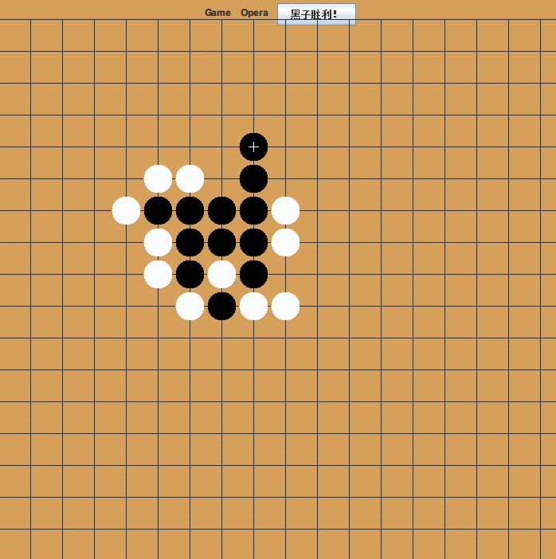

## 功能

0. 人机/人人 可切换模式
1. 悔棋至初：下棋若只如初见
2. 智能提示：无论是PVP、PVE，都能使用智障提示
3. 畅爽动画：启动、拖动、落子、悔棋、结束都带有流畅和人性化的动画
4. 文件备份：一不小心加上去的功能
5. 难度调整：简单、普通、困难 三个难度，菜单颜色也不同
6. 滑稽样式：唯（Chou）美（Bi）彩蛋

---

## PVP & PVE

- 玩家 VS 玩家
- 玩家 VS 电脑
- 电脑 VS 电脑（AI 智能提示）

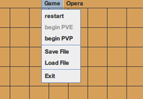

AI 有三个难度等级：

 - Simple
 - Normal
 - Hard

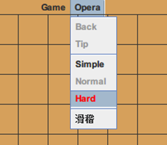

Simple有不小的随机性，Normal 相当于小高手的程度，Hard 则为 AI 完全状态，一般人胜率低于十分之一。

## AI 智能提示

不会对弈？
没关系！
使用AI提示，
默默地做个路人，
看电脑自相残杀吧！

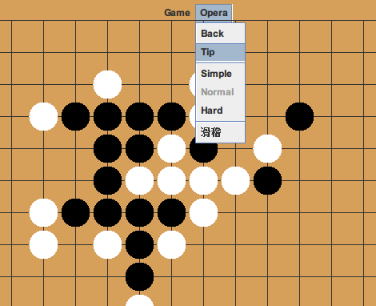

## AI 棋型

- 全盘扫描
- 20多种情况
- 150多种具体棋型
- 统计分析
- 在实践中手动调整

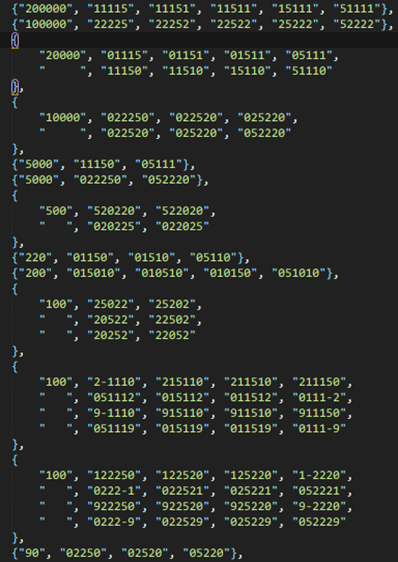

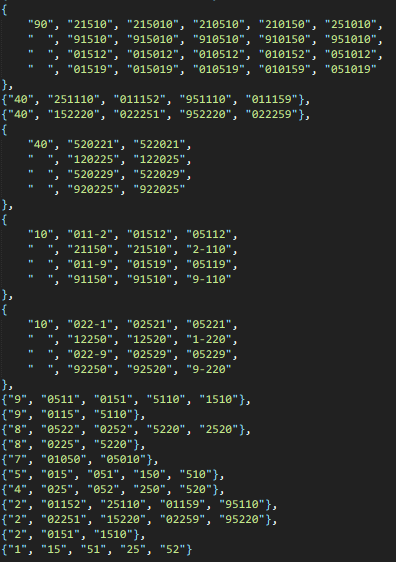

来见证它的强大吧！

## 动画

1. 启动动画

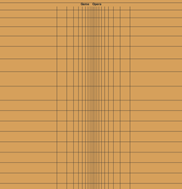

2. 思考动画

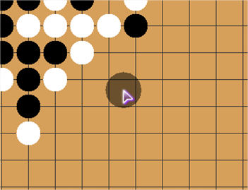

3. 落子动画

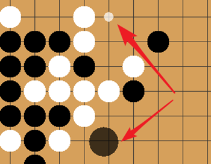

4. 悔棋动画

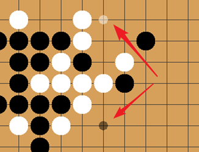

5. 结束动画

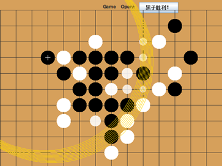

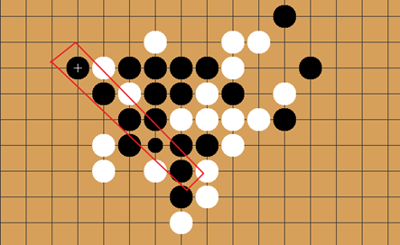

重点在这结束动画上，它不仅仅只是一个好看的动画，而且突出了这是一次艰险的战争。

你看，胜利的一方在落子的那一瞬间，会出现一圈圈涟漪搬的光环，向世界宣布：我胜利了！

光环是黄色的，略微椭圆，宽度也微微变化，不死板，活灵活现。所过之处，输家的棋子则会进行抖动，这像不像在强敌面前的瑟瑟发抖呢？

而在光环之后，则是胜利的的跳跃，连成五子的棋子（至少五颗）会依次进行跳跃般的欢呼！
OVER！

## 趣味：滑稽样式

